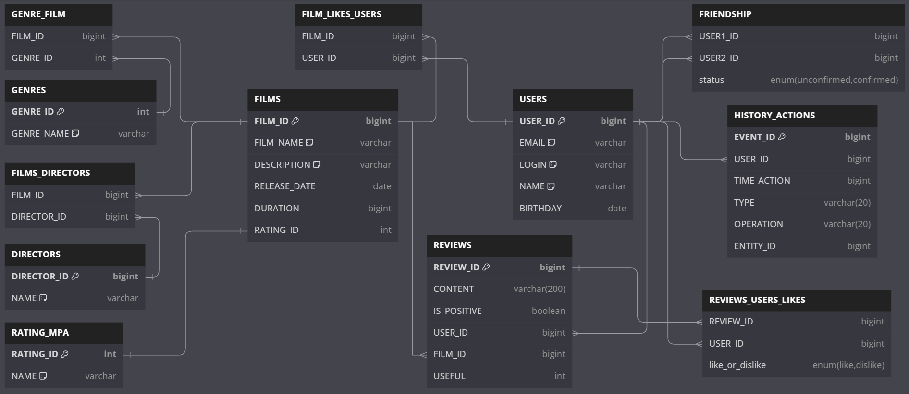

# java-filmorate
Template repository for Filmorate project.

# Database schema


# Requests
+ Getting all movies: ```SELECT * FROM films;```
+ Getting all users: ```SELECT * FROM users;```
+ Getting all genres: ```"SELECT * FROM genres ORDER BY genre_id"```
+ Getting all mpa: ```"SELECT * FROM rating_mpa ORDER BY rating_id"```